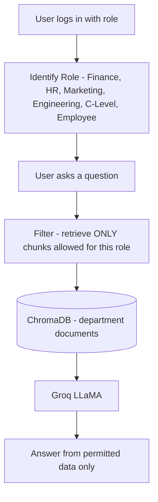
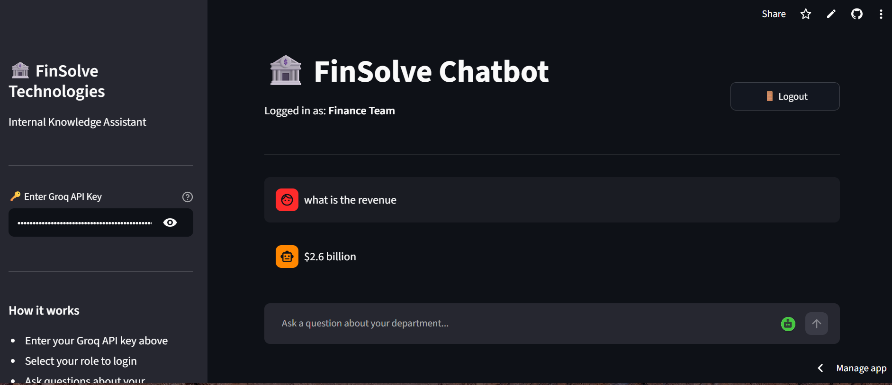
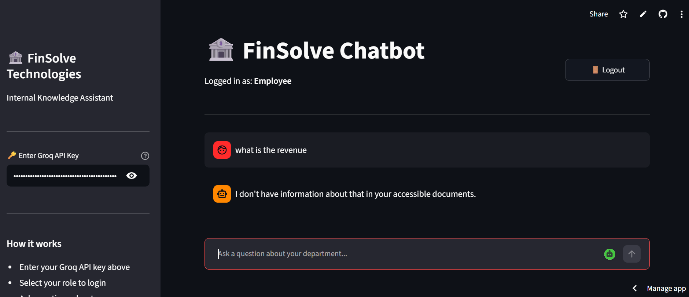

# 🔐 FinSolve RBAC Chatbot — Role-Based Access Control + RAG

A role-based access control chatbot for FinSolve Technologies. Employees log in with their role and can only ask questions about their department's data. The AI generates answers strictly from allowed documents — confidential information stays restricted by role.

## 🚀 Live Demo
**[Try the app here](https://finsolve-rbac-chatbot-l6q2e5bgdvd8hen3x5etmu.streamlit.app/)**

## 📌 The Business Problem
In any company, **not everyone should see everything.** Finance data shouldn't be visible to Marketing; HR records shouldn't be open to Engineering. A naive company chatbot would leak confidential information across departments. **This chatbot enforces role-based access** — each user only retrieves answers from data their role is permitted to see.

## 🏗️ Architecture



## ⚙️ How It Works
1. User logs in with a role (Finance, HR, Marketing, Engineering, C-Level, or general Employee)
2. When they ask a question, retrieval is **filtered by their role** — only their department's documents are searchable
3. The LLM answers using only the permitted data
4. C-Level has full access; Employees see general info only

## ✅ Results / What It Does
- **6 roles** with enforced access boundaries
- **RBAC + RAG** — access control applied at the retrieval step (metadata filtering by role)
- Each role only ever sees answers from data it's authorized to access
- Demonstrates a real enterprise security pattern, not just a chatbot

## 📸 Screenshots

**Login with role**



**Role-restricted answer**



## 🛠️ Tech Stack
- **LLM:** Groq + LLaMA 3.1
- **Framework:** Langchain
- **Vector DB:** ChromaDB
- **Embeddings:** HuggingFace
- **Access Control:** Role-based metadata filtering
- **Frontend:** Streamlit

## ▶️ Run Locally
1. Clone the repo:
```
git clone https://github.com/Murtaza-data/finsolve-rbac-chatbot.git
cd finsolve-rbac-chatbot
```
2. Install dependencies:
```
pip install -r requirements.txt
```
3. Enter your Groq API key in the sidebar
4. Run the app:
```
streamlit run app.py
```
